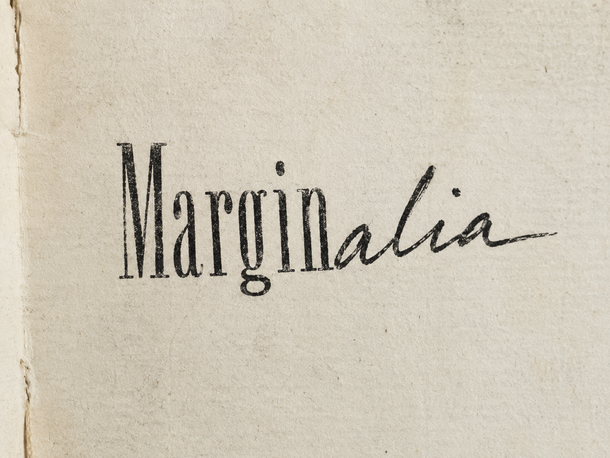

<p align="center">
  
</p>

<p align="center">
  <strong>Marginalia</strong><br/>
  <em>Your understanding, preserved.</em>
</p>

<p align="center">
  
  
  
  
  
</p>

---

## The problem

There is a particular kind of loss that happens silently, paper by paper, across a research career.

You read something carefully. Something clicks — a connection to a method you tried six months ago, a question the authors didn't ask, a suspicion that their parameterisation won't hold at high temperatures. You underline a sentence. Maybe you scribble something in the margin. Then you close the PDF and move on.

Three weeks later, you remember that you had a thought. You cannot remember what it was. The underline is there. The margin note is illegible, or gone entirely, or trapped inside a PDF on a device you no longer use.

The thought — yours, original, the product of your specific expertise reading this specific paper — is gone.

This is not a minor inconvenience. **It is the slow erosion of the thing that makes a researcher irreplaceable:** the accumulated, connected, personal understanding that cannot be reconstructed by any language model, because it was never written down anywhere a language model could reach.

---

## What Marginalia does

An iPad app for reading research papers the way researchers actually read them: pen in hand, writing in the margins.

- **Apple Pencil on the PDF.** Circle, underline, write in your own handwriting. Strokes are anchored to each page and survive scroll and zoom.
- **Voice notes while you read.** Tap mic, speak, stop. Whisper large-v3 transcribes on your own hardware — tuned for accented English and scientific vocabulary.
- **Ink → searchable text.** One tap converts handwritten strokes to a text note using Apple's on-device Vision ML. No network needed.
- **Tag your thinking.** Mark notes as Note, Question, Connection, Idea, or Disagreement when you capture them.
- **Reading intention.** Before you start, write why you saved this paper and what you're looking for. Stays visible in the sidebar while you read.
- **Reflect.** Come back to what you wrote and re-engage with your own thinking — four modes designed around how memory and understanding actually work.

---

## What it is not

- Not a summariser. AI summaries replace thinking. Marginalia captures it.
- Not a cloud service. Everything runs on hardware you own.
- Not a subscription. Free forever.
- Not another Zotero. It works *with* your Zotero library.

---

## How it works

```
Your iPad                     Your always-on Mac (Mac Mini or MacBook)
─────────────────────         ────────────────────────────────────────
PDF viewer (PDFKit)           FastAPI backend  :8000
Apple Pencil → ink            Zotero API  →  your library metadata
Handwriting → text  ◄───►    ~/Zotero/storage  →  PDF files
Voice → audio                 Whisper large-v3  →  transcription
Notes sidebar                 SQLite  →  your notes
Reflect sheet                 Ollama (local LLM)  →  recall prompts
```

All communication over Tailscale (or your local network). No cloud. No third-party servers.

---

## Reflect

After you've taken notes on a paper, tap **Reflect** in the notes sidebar. A sheet opens with four modes:

**Recall** — the only mode that uses AI. Your notes go to a small local model running on your Mac (Ollama). It sends back questions that ask *you* to explain your own reasoning — not the paper's content. One prompt at a time. You write or speak your response. Model output is always labeled so it's never presented as your own thought.

**Revisit** — no AI. Your notes in chronological order, oldest first. For each one: did you still think the same thing by the end? Write or speak a follow-up. Saves as a connection note.

**Resolve** — no AI. Filters only notes you tagged as Question or Disagreement. For each: did you find an answer? Did your view change? Write or speak a resolution.

**Close reading** — no AI. Pick any page from the page bar. All your annotations for that page are shown together. Write or speak a synthesis in your own words. Saves as a note on that page.

Voice input is available in every response field across all four modes.

---

## Setup

See **[SETUP.md](SETUP.md)** for full instructions: backend installation, Zotero credentials, building the iPad app, Tailscale, Whisper model options, Ollama, and troubleshooting.

The short version:
1. Clone the repo, install Python dependencies, copy and configure `marginalia_backend.py`
2. Run the backend on a Mac you own
3. Open `Marginalia.xcodeproj` in Xcode, sign with your Apple ID, run on your iPad
4. Tap ⚙ in the app and paste your Mac's IP

---

## Contributing

Issues and PRs welcome. Read `CLAUDE.md` before contributing — it has the full architecture, design system, and coding conventions.

---

## Acknowledgements

- [Zotero](https://www.zotero.org) — the reference manager that respects researchers
- [faster-whisper](https://github.com/SYSTRAN/faster-whisper) — Whisper inference that runs on real hardware
- [Tailscale](https://tailscale.com) — making "your own server" actually work
- [Ollama](https://ollama.com) — local LLMs without a PhD in DevOps
- The generation effect (Slamecka & Graf, 1978) — the cognitive science this is built on

---

## Built with Claude

This project was designed and built with the help of [Claude](https://claude.ai) (Anthropic). The architecture, Swift app, Python backend, and design system were developed collaboratively through Claude Code.

---

<p align="center"><em>"What you understand by yourself is yours."</em></p>
